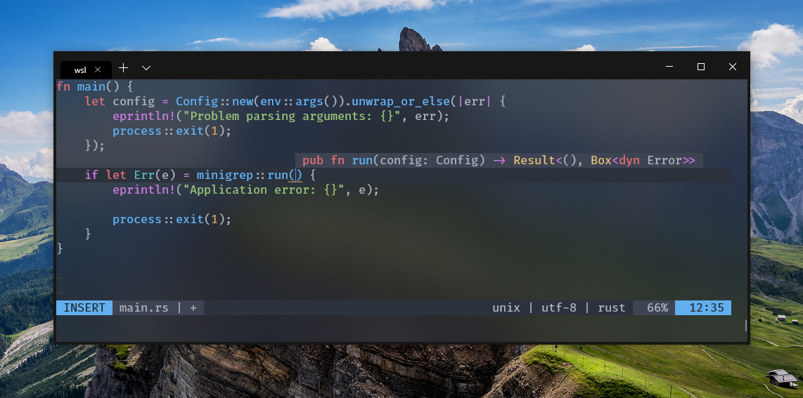

# Neovim

## Install

### Required
* [Neovim](https://github.com/neovim/neovim). Vim would work for the most part, but would miss out on [coc.nvim](https://github.com/neoclide/coc.nvim) intellisense.
* A plugin manager. The `init.vim` in this directory is set up to use [`vim-plug`](https://github.com/junegunn/vim-plug). Plugins can then be installed with `:PlugInstall`.

### Optional
* [Fira Code](https://github.com/tonsky/FiraCode) font with ligature support. 

## Features
* Autocompletion for Rust, TypeScript, JavaScript and CSS using [`coc.nvim`](https://github.com/neoclide/coc.nvim)
* Linting for TypeScript and JavaScript using [`eslint`](https://github.com/eslint/eslint) and [`@typescript-eslint/parser`](https://github.com/typescript-eslint/typescript-eslint).
* Format TypeScript, JavaScript, CSS, SCSS and Less on save using [`prettier`](https://github.com/prettier/prettier).

### Shortcuts
The <kbd>leader</kbd> character is mapped to <kbd>,</kbd>, but can be changed in `init.vim`.

**Move line(s) up and down**  
In normal and visual mode, the current or selected line(s) can be moved up and down with <kbd>Alt</kbd> + <kbd>k</kbd> and <kbd>Alt</kbd> + <kbd>j</kbd> respectively.

**Comment and uncomment line(s)**  
In normal and visual mode, the current or selected line(s) can be commented and uncommented with <kbd>leader</kbd> + <kbd>c</kbd> + <kbd>space</kbd>. 

## Preview

